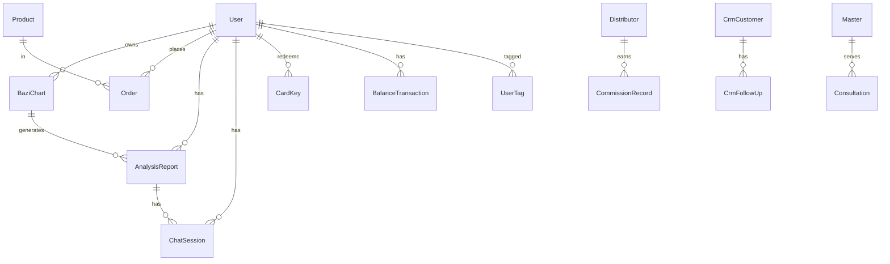

# 领域数据字典与实体关系

**真源文件**：[../apps/api/prisma/schema.prisma](../apps/api/prisma/schema.prisma)。本文档说明业务含义与扩展点，字段级完整定义以 Prisma 为准。

---

## 实体关系（概览）

---

## 模型分组说明

### 用户系统：`User`、`UserTag`

| 模型 | 用途 |
|------|------|
| `User` | 登录身份、档案、VIP、社交登录 id、推荐人 `referrerId`、角色 `role`（`user` / `admin`）、状态等 |
| `UserTag` | 用户标签：`tagCategory`（如 behavior/consume/bazi/custom）、`tagKey`/`tagValue` |

**常用枚举（整型）**：

- `gender`：0 未知，1 男，2 女（命盘等场景也沿用）
- `identityType`：0 普通，1 企业老板，2 投资人，3 高净值
- `vipLevel`：0 免费，1 基础，2 高级，3 企业
- `status`：0 禁用，1 正常

### 命盘：`BaziChart`

存储一次完整排盘结果：四柱、藏干、十神、纳音、五行、格局、用神、神煞、大运 JSON、真太阳时修正、算法与引擎版本号等。

| 字段类 | 说明 |
|--------|------|
| 四柱与 `hour_*` | 年柱至时柱的天干地支 |
| `*Hidden` | 各柱藏干，JSON |
| `tenGodsMap` | 十神结构，JSON |
| `wuxingCounts` / `wuxingScore` | 五行统计与评分，JSON |
| `dayunList` | 大运列表，JSON |
| `shenshaList` | 神煞，JSON |
| `jiShen` / `tiaohuoNeed` 等 | 调候、忌神等扩展，JSON |
| `algorithmVersion` / `engineVersion` | 追溯排盘与历法引擎版本 |
| `midnightRule` | 子时换日规则标识 |

**扩展建议**：新算法特征优先增量 JSON 或独立列，并提升 `algorithmVersion` 便于回滚与对账。

### 规则与 Prompt：`Rule`、`Prompt`

| 模型 | 用途 |
|------|------|
| `Rule` | `module` 区分领域（如 ten_gods/pattern/yongshen/dayun/wealth/risk/hehun/partner）；`conditions` + `actions` 为可执行 DSL；`priority`、`abGroup`、AB、命中 `hitCount` |
| `Prompt` | 按 `promptId` + `version` 唯一；`content` / `systemPrompt`；`modelProvider` / `modelName`；变量 `variables` JSON |

**高频扩展点**：新增业务线时增加 `module` 枚举约定（代码与文档同步），避免随意字符串。

### 产品订单：`Product`、`Order`

- `Product`：`productCode`、类目 `category`、价格、`reportType`、`config` JSON、分销佣金率 `commissionRateL1/L2` 等
- `Order`：金额拆分、优惠券、支付渠道、**分销追溯** `referrerId` 与 `commissionL1/L2`、状态机（0 待付～5 已取消 等，见 schema 注释）

### 分析报表：`AnalysisReport`

| 字段 | 说明 |
|------|------|
| `ruleResults` / `ruleScores` / `ruleTags` | 规则引擎输出 |
| `aiContent` / `aiSummary` 等 | AI 结果与元数据 |
| `isPaid` / `orderId` / `productId` | 商业关联 |
| `upsellHook` / `upsellProductId` | 转化位 |

### 分销：`Distributor`、`CommissionRecord`

二级分销树：`parentId`；佣金流水与状态（待结算/已结算/已提现）。

### CRM：`CrmCustomer`、`CrmFollowUp`

客户分群、阶段、跟进记录；`baziTags` JSON 可存命盘相关标签；`CrmFollowUp` 可标记 AI 建议话术。

### 命理师：`Master`、`Consultation`

咨询单、消息 `messages` JSON、金额分成字段。

### AI 配置：`AiModelConfig`

多 Provider 的 `apiKey`、`baseURL`、`defaultModel`、`availableModels`；与 `AiService` 及 seed 数据协同。

### 自动成交：`AutoConversionLog`

触发型营销/跟进日志及转化归因字段。

### 聊天：`ChatSession`、`ChatMessage`

- 会话与 `AnalysisReport` 绑定；`mem0UserId` / `mem0AgentId` 对接 Mem0
- 消息含 `mem0Added`、用户反馈分 `feedbackScore`

**约束**：`ChatSession` 上 `@@unique([userId, reportId])` 表示同一用户同一报告单会话（业务上可按产品调整是否允许多会话）。

### 卡密与余额：`CardKey`、`BalanceTransaction`

| 模型 | 用途 |
|------|------|
| `CardKey` | 预生成的充值卡密码。`code` 唯一 16 位大写字母+数字；`amount` 面值；`batchNo` 批次号；`status`（0 未使用 / 1 已使用 / 2 已作废）；`usedById` 使用者 / `usedAt` / `expireAt` |
| `BalanceTransaction` | 余额变动流水。`type`：`recharge` 充值 / `payment` 消费 / `refund` 退款 / `admin_adjust` 后台调整；`amount` 正入负出；`balanceAfter` 快照；`refId` + `refType` 关联（`card_key` / `order` / `admin`） |

**`User.balance`**：`Decimal(12,2)`，默认 0，由 `CardKeyService.redeemCardKey` 和 `OrderService.payWithBalance` 在事务中增减。

### 系统配置

| 模型 | 用途 |
|------|------|
| `SystemConfig` | 通用键值配置表。`key` 唯一标识（如 `site`、`payment`）；`value` 为 `Json` 类型存储对应配置结构 |

预定义 key：

- **`site`**：站点基础信息（title / subtitle / description / keywords / favicon / logo / brandName / brandNameEn / footer / icp / contactEmail / contactPhone）
- **`payment`**：支付方式开关配置（wechat / alipay / balance / card_key 各含 `enabled` / `label` / `sortOrder`）
- **`payment_credentials`**：支付渠道密钥配置（敏感字段 AES-256-CBC 加密存储），结构如下：
  - `wechat`：`appId` / `mchId` / `serialNo`（商户证书序列号）/ `privateKey`（PEM 格式商户私钥，加密存储）/ `notifyUrl` / `apiV3Key`（V3 密钥，加密存储）
  - `alipay`：`appId` / `privateKey`（应用私钥，加密存储）/ `alipayPublicKey` / `notifyUrl` / `returnUrl` / `signType`（固定 `RSA2`）

---

## 与 `packages/shared` 的类型对应

[../packages/shared/src/index.ts](../packages/shared/src/index.ts) 中 `BaziChart`、`Pillar`、`DaYun` 等描述「历法层」结构，与 Prisma 存库字段名不完全相同（下划线 vs camelCase），二开时以 API 响应序列化与 Prisma 为准，共享包用于前端展示契约。

---

## 索引与性能提示

- `User`：`phone`、`username`、`referrerId`、`vipLevel+vipExpireAt` 等
- `BaziChart`：`userId`、`dayGan`、`patternType`
- `Order`：`userId+status`、`orderNo`、`referrerId`
- `AnalysisReport`：`userId+reportType`、`chartId`
- 更多见 schema 中 `@@index`

---

## 变更登记（维护时更新）

- 初版与当前 `schema.prisma` 一致；每次迁移后在 Git 提交说明中提一句本字典是否已更新，避免遗漏 JSON 语义说明。
